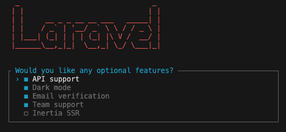
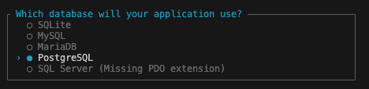

# Setup

## Create new Laravel project

-   [Documentation](https://laravel.com/docs/11.x#creating-a-laravel-project)

```bash
laravel new --dark --jet --stack=inertia --api --teams --verification --pest -- app-starter-kit
```

-   choose features and press 'enter'



-   choose database and skip running migrations for now


