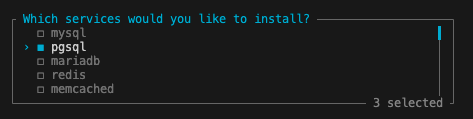
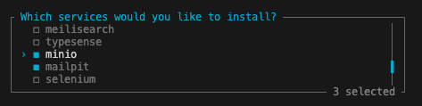
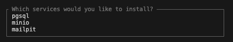

# Sail

## Installation

-   [Documentation](https://laravel.com/docs/11.x/sail#installing-sail-into-existing-applications)

```bash
composer require laravel/sail --dev

php artisan sail:install
```

-   choose the services needed for development





-   example ( `pgsql` for database / `minio` for S3 file storage / `mailpit` for email testing )


